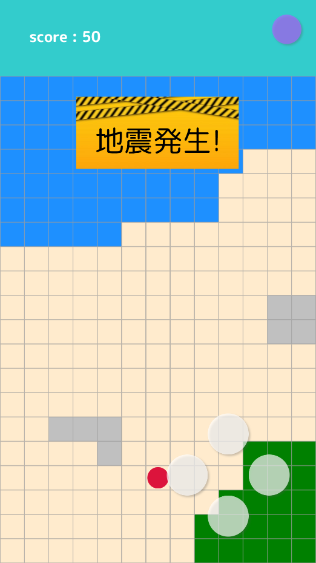

# picmin

災害を想定したシミュレーションゲーム

## 概要
津波が起こった木更津市で、被害に遭わないように避難をするゲーム。

## 遊び方
**[ゲームページへアクセスする](https://stomachachers.github.io/picmin/)**

①　スタートボタンを押してゲームスタート   
②　ゲーム内の十字キーを使って迫りくる津波から逃げ切れ！   
③　逃げた時間に応じてスコアをゲット！   

## ゲームのねらい
普段生活をしている木更津市の土地を舞台にすることで、
地震で壊れやすい建物や、津波が来る恐れの高い場所、
市内にある避難所などをゲームを通じて知ってもらうことができるため、
いざ災害にあったときでも素早く安全な避難経路を考え、
避難する力を養うことができる。

## 担当
- デザインプログラム : 及川
- デザイン : 尾畑
- ゲームプログラム : 土井

## 開発技術
- HTML/CSS
- Javascript(CreateJS)

## 実装を見送った機能
- 木更津市を舞台にする   
    オープンデータ(土地・建物情報)を活用して、
    ゲーム内で木更津市の一部を再現する。
- 津波の来る速さを土地ごとに変える   
    土地の高さで津波の到達速度を変える。
- 地震で建物が倒壊する   
    津波の前の地震で建物が倒壊し、
    倒壊したマスは侵入不可という制約がつく。
- 避難所の設置   
    安全地帯や、ボーナススコア用。
- 特定条件を満たすとボーナススコア   
    避難所がわからない市民を避難所まで誘導できればボーナス加算。
- 自分の目線しか見えない実戦モード   
    上から見る、いわゆる2Dマップではなく、
    自分の周囲だけしか見えず、より実践的な避難力が試されるモード

